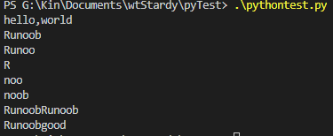
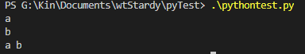

# 学习笔记  

> 编程方式  
1. 交互式编程  
```shell
python  
```  
  
2. 脚本式编程  
```shell
python xxx.py
```
  

> 标识符  
* 字母  
* 数字(*不能作为首字母*)
* 下划线
* 对大小写敏感  
* 支持中文等 

> 注释  
1. 单行注释  
```python
# 一行注释 
# print("hi,someone")

print("hi, boys")  
```
2. 多行注释  
```python
''' 
第一行注释
第二行注释
第三行注释
'''

"""
第一行注释
第二行注释
第三行注释
"""
```  
> 缩进  

相同缩进属于同一代码块
```python
if True:
    print(1)
    print(2)
else:
    print(3)
print(4)
```
  

> 多行语句  

一行写完一语句,如果语句很长,可以使用反斜杠(\)来实现多行语句.

> 数字(number)类型  

* int(整数):只有一种整数类型int,表示为长整型,没有Python2中的long.
* bool(布尔):true,false.
* float(浮点数):1.33.
* complex(复数):1+2j.  

> 字符串  

* 'abc' , "abc"  
* '''
  my name is wangting.
  i like my family.
  my family had three people.  
  '''  
* I like cooking.\n such as,potato some kind of meat.(加 r 不转义)  
* 字符串有俩种索引方式,从左向右以0开始,从右向左以-1开始.  
* 字符串不能改变. 

* 操作实例  
  str = "Runoob"  
  print(str)  
  print(str[0:-1])  
  print(str[0])  
  print(str[2:5]) 
  print(str[2:])  
  print(str * 2)  
  print(str + 'good')  

    

> 空行  

函数之间或类的方法之间用空行分隔  
类和函数之间也用空行分隔  
空行与代码缩进不同,空行并不是python的一部分  
空行也是代码程序的一部分,便于代码维护  

> 一行显示多条语句  

语句之间用(;)隔开  
 
> 多个语句构成代码组  

缩进相同的一组语句构成代码组.  
像if ,else语句,以关键词开始,以(:)结束,之后的一行及多行代码构成代码组.  

> Print输出  

默认换行, 如不换行在变量末尾加end=" ".  
x = 'a'  
y = 'b'  
print(x)  
print(y)  
print(x,end=" ")  
print(y,end=" ")  



> 基本数据类型  


