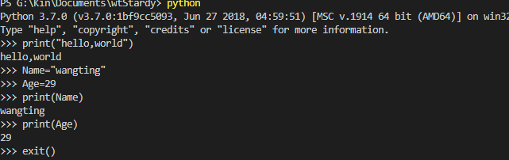
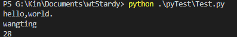
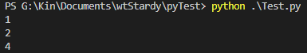

# 学习笔记  

> 编程方式  
1. 交互式编程  
```shell
python  
```  
  
2. 脚本式编程  
```shell
python xxx.py
```
  

> 标识符  
* 字母  
* 数字(*不能作为首字母*)
* 下划线
* 对大小写敏感  
* 支持中文等 

> 注释  
1. 单行注释  
```python
# 一行注释 
# print("hi,someone")

print("hi, boys")  
```
2. 多行注释  
```python
''' 
第一行注释
第二行注释
第三行注释
'''

"""
第一行注释
第二行注释
第三行注释
"""
```  
> 缩进  

相同缩进属于同一代码块
```python
if True:
    print(1)
    print(2)
else:
    print(3)
print(4)
```
  

> 多行语句  

一行写完一行语句,如果语句很长,可以使用反斜杠(\)来实现多行语句.

> 数字(number)类型  

* int(整数):只有一种整数类型int,表示为长整型,没有Python2中的long.
* bool(布尔):true,false.
* float(浮点数):1.33.
* complex(复数):1+2j.  

> 字符串  


