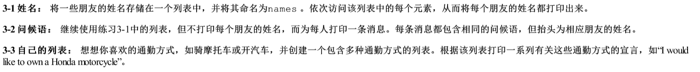

> 定义  

用方括号[]来表示列表,并用逗号(,)分隔其中的元素.  

* 访问列表元素  
列表名称,元素索引.list[0]  
list = ["apple","orange","banana"]  
可以使用title(),upper(),lower()让列表中的字符串格式更整齐.  

  fruit = ["apple","orange","banana"]   
  print(fruit[0].title())  
  print(fruit[-1].upper())  
  print(fruit[0])  

  PS G:\Kin\Documents\wtStardy\pyTest> .\列表\test.py  
  Apple  
  BANANA  
  apple  
  # title,upper,lower,strip这类函数运行结束后变量又变回起始值,如需保存要再赋值变量.

* 索引左边从[0]开始,右边从[-1]开始  

* 使用列表中的各个值  

  message = "my favorite fruit is " + fruit[0] + "."  
  print(message)  

* 作业  

)  

