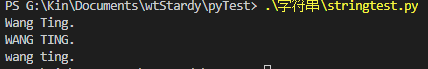
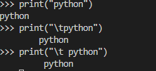
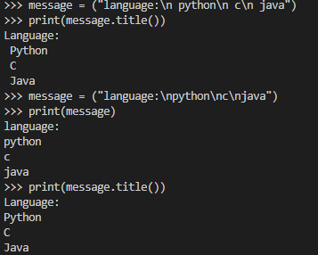
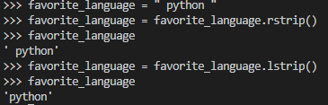
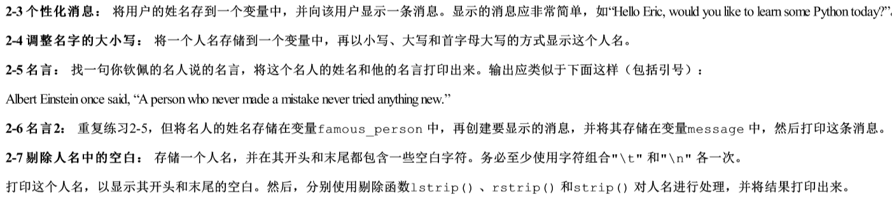
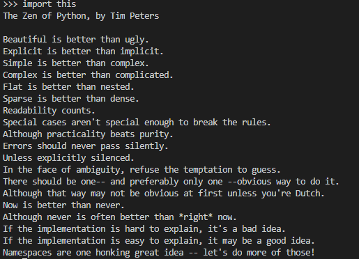

* 字符串  

> 定义  

一串字符,用单引号或双引号括起的.  
"my name is wangting."  

> 修改字符串中字母的大小写 

name = "wang ting."

  

print(name.title())  将首字母大写   
print(name.upper())  全部字符大写  
print(name.lower())  全部字符小写  

  

> 合并(拼接)字符串  

例如:姓和名储存在不同变量中,等要显示姓名时将它们合并.

first_name = "agela"  
last_name = "juliet"  
full_name = first_name + " " + last_name  
print("hi," + full_name.title() + "!")  

.PNG)  

> 使用制表符或换行符来添加空白  

* \t 添加制表符  

  

* \n 换行符  
字符串中不要随意添加空格,换行符之后不需添加,已经默认为下一行.

> 删除空白  

额外的空白,可能让人迷惑.  
使用 rstrip(),lstrip(),strip()删除字符串右边,左边,俩边空白.   
但这只是暂时的,想永久删除字符串空白,需将删除后的结果存回变量.

  

> 使用字符串时避免语法错误  

如果使用单引号括起字符串,字符串中再出现单引号就会出错.  
所以,我认为,通常字符串用双引号括起.  

> 作业  

  

*python之禅

  

